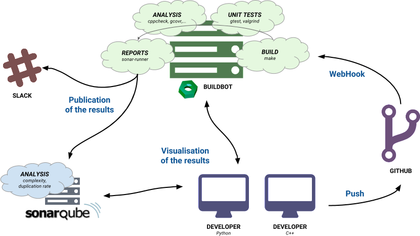

##持续集成工具--Skies如何打造其持续集成平台

###译
* 原文链接：[Continuous Integration tools - How Skies built his CI Platform](https://www.dewep.net/realisations/en/continuous-integration-tools)
* 版权归原作者所有
* 首次翻译，会有很多问题，欢迎指正。

###序言

我在Skies的技术博客上发表了这篇文章，Skies是一个只有七人的技术初创团队，专注于更智能的存储--一个软件定义存储的解决方案，目标定位于公司大数据存储。

客观的说，我们的产品解决如下问题：

* 降低服务器的耗能
* 高效率的存储数据及节省数据存储空间

###简介

在一个大项目团队中工作不是一件容易的事情。比较大的项目一般有相当多行的代码，且这些代码由不同的编程语言组成，大项目有很多模块及子项目依赖。开发者同时工作于软件的多个部分。此种情况下，产出一个干净及稳定创建的产品将变成一场噩梦。

基于上述情况，持续集成（CI）将登场。持续集成系统的实践需要开发者以天为基础提交他们的代码到一个代码分支，并执行一系列测试和构建命令。对持续集成（CI）更详尽的定义可以查看[Thoughtworks](https://www.thoughtworks.com/continuous-integration)的文章。

在项目开始之初花费一些时间，搭建一个平台来支持持续集成系统的开发实践以用来早期发现错误和减少技术债，对于Skies来说是相当重要的。我们想通过确保每个代码部分都总是经过测试的（函数层，执行速度，网络性能，代码质量）来提升我们的生产力及我们产品的可靠性。为此，我们必须使用并设置一些工具。

我们的项目主要开发语言为C++，并托管在GitHub上。我们选择使用[GoogleTest](https://github.com/google/googletest)来创建我们的单元测试。

然而，这篇文章并没有覆盖如何创建单元测试的知识，但是描述了一些工具来使源代码分析工程化。在每一次源代码修改时抓取并编译，然后在统一的接口生成报告，并在[Slack](https://slack.com/)或者通过邮件发布结果。我们还做了以下事情：

* 静态代码分析
* 复杂度（complexity）
* 重复代码（code duplication）
* 执行单元测试
* 计算代码覆盖率
* 测试应用性能

我们在寻找相应工具时，主要遵循以下：

* 开源许可
* 支持unix平台
* 可以和GIT集成
* 支持多编程语言（C++, Python, Javascript等）
* 被维护的及很好的文档
* 被创立的公司所使用

以下是我们的候选工具。

###Jenkins

当然，第一个被测试的时Jenkins(MIT license)。它是最广为人知且被广泛使用（eBay, Google, Facebook, NetFlix, Yahoo and many others）的持续集成（CI）工具。它的安装相当简单和快速。

一旦你了解了你想使用的分析工具后，完成工具的配置是十分简单的。在我们的情况下，我们使用[GoogleTest](https://github.com/google/googletest)来做单元测试，[cppcheck](http://cppcheck.sourceforge.net/)做源代码静态分析，[gcovr](http://gcovr.com/)做覆盖率计算。通过Makefile来完成不同的compilations（不知道怎么翻译）。这些任务通过Ant配置文件定义。这时，我们只需要安装Jenkins插件取回并格式化结果即可（Cobertura插件用来处理gcovr的输出，Cppcheck插件用来处理cppcheck）。

你可以查看我们的Ant file内容：

```
 1 <?xml version="1.0" encoding="UTF-8"?>
 2 <project name="CppApp" default="jenkins" basedir=".">
 3     <description>
 4         Jenkins - Ant file - Cpp Project
 5     </description>
 6 
 7     <target name="init">
 8         <tstamp/>
 9     </target>
10 
11     <target name="clean" description="Clean up" >
12         <exec dir="./" executable="/usr/bin/make" failonerror="false">
13             <arg value="clean"/>
14         </exec>
15     </target>
16 
17     <target name="compile" description="Compile the source files">
18         <exec dir="./" executable="/usr/bin/make" failonerror="true">
19         </exec>
20     </target>
21 
22     <target name="compile-tests" description="Compile the tests files">
23         <exec dir="./" executable="/usr/bin/make" failonerror="true">
24             <arg value="unit_tests"/>
25         </exec>
26     </target>
27 
28     <target name="gtest" description="Run GTest" depends="compile-tests">
29         <exec dir="./" executable="./unit_tests" failonerror="true">
30             <arg line="--gtest_output='xml:./outputGTest.xml'"/>
31         </exec>
32     </target>
33 
34     <target name="cppcheck" description="Run cppcheck static code analysis" >
35         <exec dir="./" executable="/usr/bin/cppcheck" failonerror="true">
36             <arg line="--xml --xml-version=2 --enable=all --inconclusive --language=c++ ./src/"/>
37             <redirector error="outputCppCheck.xml"/>
38         </exec>
39     </target>
40 
41     <target name="gcovr-xml" description="Run gcovr and generate coverage XML output">
42         <exec dir="./" executable="/usr/local/bin/gcovr" failonerror="true">
43             <arg line="--branches --xml-pretty -r ./src/"/>
44             <redirector output="outputGcovr.xml"/>
45         </exec>
46     </target>
47 
48     <target name="gcovr-html" description="Run gcovr and generate coverage HTML output">
49         <exec dir="./" executable="/usr/local/bin/gcovr" failonerror="true">
50             <arg line="--branches -r ./src/ --html --html-details -o outputGcovrReport.html"/>
51         </exec>
52     </target>
53 </project>
```

安装、配置、通过Jenkins进行测试执行不是特别困难。然而，面向开发者的分析结果和报告界面不是很悦目。Jenkins界面很古老且设计不良好，其它的都不错。我们更倾向于寻找另一款持续集成系统，更现代、设计更优良。我们将Jenkins作为备选方案。

###Strider-CD

Strider-CD是一款开源的持续集成及部署平台。它的安装真的很简单。我通过web接口来clone我的项目并添加所有命令（在Ant文件当中的内容）。

几分钟之后，我就成功执行了我的所有测试。然而，这款持续集成系统的最主要的问题是没有分析报告；你只能设置一系列命令，将测试和部署分成两部分。

此外， in spite of a quick installation，界面不是很完美：某些部分没有完成，有bug并且缺少某些特性。

###BuildBot

下一个测试的工具是[BuildBot](http://buildbot.net/)(GPL license)。它是使用Python编写的开源持续集成系统。对比前面几款，BuildBot的安装和配置稍微复杂一些。

确实，不像其它工具一样通过GUI进行大部分配置，BuildBot必须通过一个Python文件进行配置。它在我们定义的任务列表里，用来调用构建器的GitHub钩子，管理者访问，以及更多...在起初，即使它开起来十分复杂（凌乱的文档没什么帮助），配置还是可以容忍的。此外，一旦你已经了解了配置的每一部分，调整配置使其解决你的问题是十分简单的。

然而，没有办法预告报告。像Strider-CD一样，BuildBot只允许执行任务并不分析结果。

最终，像Jenkins一样，界面不是很现代，但是，可以通过重写其模板文件来定制HTML和CSS。


###PaaS products

在2016年，我们不能忽略提供持续集成系统的PaaS产品，但是最终我们选择不使用它们。

为什么？

这些工具：

* 提供了特别好的UI
* 更简单和快速的设置

但是：

* 它们扩展性差且特性少（例如， 它们很多不支持pull requests或者日志压缩）
* 在这么重要的部分，我们不想依赖于第三方组织的工具，不想让我们的代码在远程服务器可访问。
* 它们中的一些（像是Hosted-CI）只是一个托管的Jenkins服务器
* 对于非开源产品来说，它们的价格太贵咯（Travis-CI 139刀每月）

可能会有人争论，托管、安装、配置和运行一个Jenkins服务器（或类似Jenkins的系统）更昂贵，但我们真的想自己维护并控制我们的持续集成系统。

虽然我们没有到处测试那些在线工具，它们可能对你有用，依赖于你的需求和标准。以下是一些可能会吸引你注意的在线CI：[TeamCity](https://www.jetbrains.com/teamcity/)，[Codeship](https://codeship.com/)，[Bamboo](https://www.atlassian.com/software/bamboo/)，[Drone.io](https://drone.io/)，[CircleCI](https://circleci.com/)，[GitLab-Ci](https://about.gitlab.com/gitlab-ci/)，[Travis-CI](https://travis-ci.com/)

###SonarQube

我们缺少的是一个允许我们分析并格式化结果（单元测试，代码覆盖率，源代码静态分析）的工具。最终我们发现了[SonarQube](http://www.sonarqube.org/)。

Sonar并不像前述的工具一样执行一堆命令。然而，它关联项目的源代码，读取结果（例如XML文件）并格式化它们。它的界面真心好，清新简洁，并且允许我们直接查看每个文件的问题所在（聚合所有结果）。

我们还使用了[Sonar-CXX](https://github.com/SonarOpenCommunity/sonar-cxx)，一个Sonar管理C++的插件。它可以读取[Valgrind](http://valgrind.org/)，[cppcheck](http://cppcheck.sourceforge.net/)，[RATS](https://code.google.com/p/rough-auditing-tool-for-security/)，[gcovr](http://gcovr.com/)，[Vera++](https://bitbucket.org/verateam/vera/overview)...

Sonar还提供了一些分析代码的特性，像是代码复杂度或者代码重复率。更进一步的使用SonarQube，可是对源代码有一个整体的能见度；如果某个问题走远了，它可以容易的纠正问题。


###我们的栈

我们已经决定使用BuildBot和Sonar来做我们的持续集成平台。

从GitHub（通过我们的GitHub Hook）收到一个事件之后，BuildBot执行我们的命令（单元测试，cppcheck，gcovr，valgrind）并且将结果传递给Sonar（通过一个叫做sonar-runner的脚本）

下面是我们使用的工具的配置文件：

```
1 # -*- python -*-
 2 
 3 # BuildBot master settings
 4 
 5 from buildbot.plugins import *
 6 
 7 c = BuildmasterConfig = {}
 8 
 9 ####### BUILDSLAVES
10 
11 c['slaves'] = [buildslave.BuildSlave("slave", "S2n6zzCzKeuTChsmbpW7")]
12 
13 c['protocols'] = {'pb': {'port': 9989}}
14 
15 ####### CHANGESOURCES
16 
17 c['change_source'] = []
18 
19 ####### SCHEDULERS
20 
21 c['schedulers'] = []
22 c['schedulers'].append(schedulers.SingleBranchScheduler(name="all", change_filter=util.ChangeFilter(branch='master'), treeStableTimer=None, builderNames=["runtests"]))
23 c['schedulers'].append(schedulers.ForceScheduler(name="force", builderNames=["runtests"]))
24 
25 ####### BUILDERS
26 
27 factory = util.BuildFactory()
28 
29 factory.addStep(steps.Git(repourl='git@github.com:skies-io/repository.git', branch='master', mode='incremental'))
30 factory.addStep(steps.ShellCommand(command=["make", "clean"]))
31 factory.addStep(steps.ShellCommand(command=["make", "unit_tests"]))
32 factory.addStep(steps.ShellCommand(command="cppcheck -v --xml --xml-version=2 --enable=all --inconclusive --language=c++ -Iinclude/ src/ 2> report-cppcheck.xml"))
33 factory.addStep(steps.ShellCommand(command=["valgrind", "--xml=yes", "--xml-file=report-valgrind.xml", "./unit_tests", "--gtest_output=xml:report-xunit.xml"]))
34 factory.addStep(steps.ShellCommand(command="gcovr -x -r . > report-gcovr.xml"))
35 factory.addStep(steps.ShellCommand(command=["/opt/sonar-runner/bin/sonar-runner", "-X"]))
36 
37 c['builders'] = []
38 c['builders'].append(util.BuilderConfig(name="runtests", slavenames=["slave"], factory=factory))
39 
40 ####### STATUS TARGETS
41 
42 c['status'] = []
43 
44 from buildbot.status import html
45 from buildbot.status.web import authz, auth
46 
47 authz_cfg=authz.Authz(auth=auth.BasicAuth([("admin", "S2n6zzCzKeuTChsmbpW7")]), forceBuild = 'auth', forceAllBuilds = 'auth')
48 github = {'github': {'secret': "692cf6d5b41c53a7a62c7f323c91038a5ac34f784eb11e92670c425e", 'strict': True}}
49 c['status'].append(html.WebStatus(http_port=8010, authz=authz_cfg, change_hook_dialects=github))
50 
51 ####### PROJECT IDENTITY
52 
53 c['title'] = "Skies Smart Storage"
54 c['titleURL'] = "https://github.com/skies-io/repository/"
55 c['buildbotURL'] = "http://127.0.0.1:8010/"
56 
57 ####### DB URL
58 
59 c['db'] = {'db_url': "sqlite:///state.sqlite"}
```

```
1 # https://github.com/SonarOpenCommunity/sonar-cxx/tree/master/sonar-cxx-plugin/src/samples/SampleProject2
 2 
 3 sonar.projectKey=CxxPlugin:SkiesSmartStorage
 4 sonar.projectName=SkiesSmartStorage
 5 sonar.projectVersion=1.0.0
 6 sonar.language=c++
 7 
 8 sonar.sources=src
 9 sonar.tests=tests
10 
11 sonar.cxx.cppcheck.reportPath=report-cppcheck.xml
12 sonar.cxx.coverage.reportPath=report-gcovr.xml
13 sonar.cxx.valgrind.reportPath=report-valgrind.xml
14 sonar.cxx.xunit.reportPath=report-xunit.xml
15 
16 sonar.cxx.includeDirectories=/usr/include,include,src
```

尽管BuildBot的配置并不简便，但是它是这些工具中限制最少的。下图是架构图：

